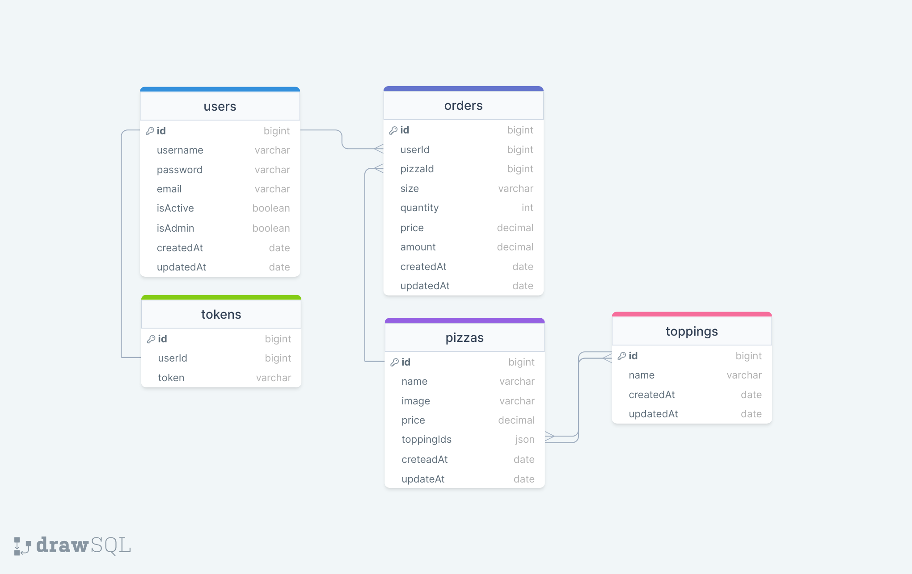

# pizza-API-Express-Mongoose-JWT

This is a RESTful API for a pizza ordering system built with Express.js, Mongoose, and JWT authentication.

##  Features

- User authentication with JWT
- CRUD operations for pizzas and toppings
- Order management
- Image upload with Multer
- API documentation using Swagger and Redoc
- Logging with Morgan
- Environment variable handling with dotenv
- Custom error handling

##  Project Structure

```
src/
├── configs/              # DB connection and configuration
├── controllers/          # Logic for each route
├── helpers/              # Utility functions (encryption, email, custom error, etc.)
├── middlewares/          # Auth, logger, permissions, error handling
├── models/               # Mongoose schemas/models
├── routes/               # API route handlers
├── uploads/              # Uploaded images
├── index.js              # Server entry point
├── .env                  # Environment variables
```

##  Installation

```bash
git clone https://github.com/recep-demir/pizza-API-Express-Mongoose-JWT-.git
cd pizza-API-Express-Mongoose-JWT-
npm install
```

### .env File

Create a `.env` file and include the following:

```
PORT=8000
MONGODB=
SECRET_KEY=
PAGE_SIZE=25
ACCESS_KEY= 
REFRESH_KEY = 
ADMIN_EMAIL= 
EMAIL_PASS= 

```

##  Run the App

```bash
npm start
```

## Technologies Used

- Express.js
- Mongoose
- JSON Web Token (JWT)
- Multer
- Nodemailer
- Swagger / Redoc
- Morgan
- dotenv

## API Documentation

You can view the API documentation at:

- Swagger: `/api-docs`
- Redoc: `/redoc`

## Test

```bash
npm test
```

> Note: Test script not implemented yet.

## ER Diagram



## 📬 Contact

GitHub: [@recep-demir](https://github.com/recep-demir)

---

**License:** ISC
